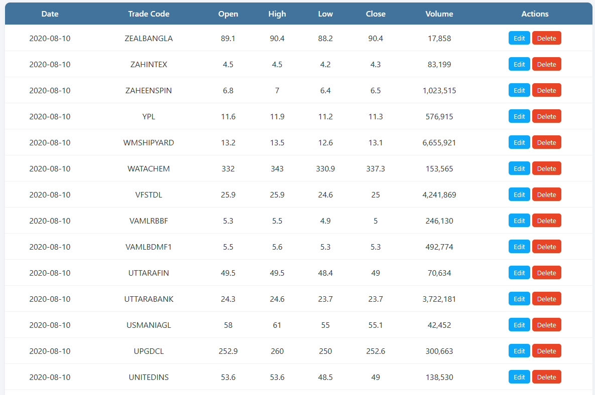
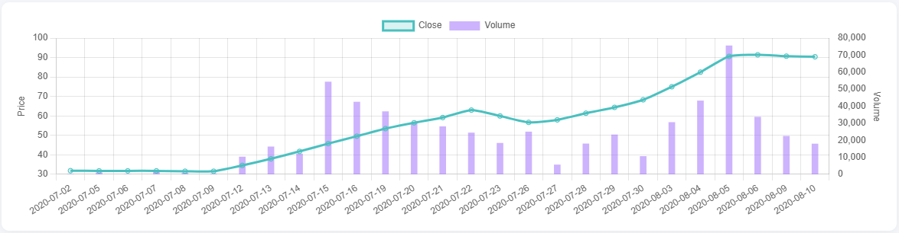
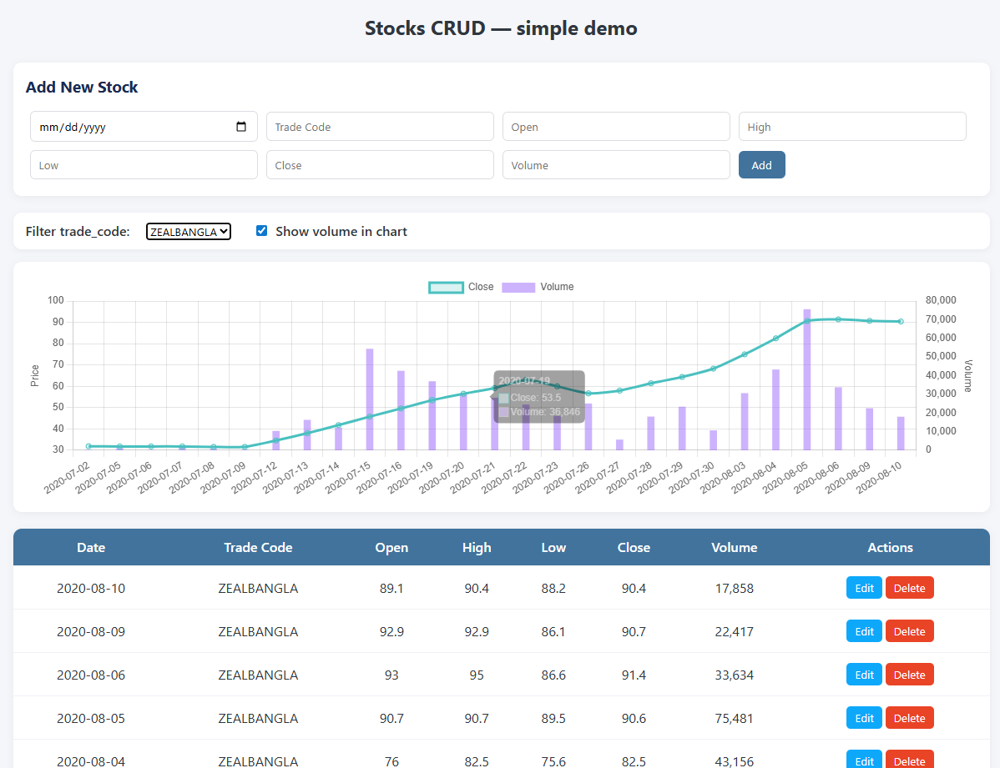

# 📈 Stocks CRUD Application

A full-stack CRUD application to manage stock data. Built with **FastAPI + SQLAlchemy** (backend) and **ReactJS** (frontend).

---

## 🌍 Deployment

- **Live Frontend:** [https://stocks-crud.vercel.app/](https://stocks-crud.vercel.app/)  
- **Live Backend:** [https://stocks-crud-backend.onrender.com/](https://stocks-crud-backend.onrender.com/) *(⚠️ may take up to 1 minute to wake up if idle on Render)*

---

## 🚀 Features

### Backend (FastAPI + SQLAlchemy)
- REST API for stock CRUD operations
- PostgreSQL/SQLite support
- Pandas integration for bulk data loading
- Alembic migrations (optional)

### Frontend (ReactJS)
- Responsive stock table
- Line chart for stock prices (with filters)
- CRUD operations with API integration

---

## 📂 Project Structure

```
stocks-crud/
├─ backend/
│  ├─ app/
│  │  ├─ main.py          # FastAPI entrypoint
│  │  ├─ models.py        # SQLAlchemy models
│  │  ├─ schemas.py       # Pydantic schemas
│  │  ├─ database.py      # Database config
│  │  ├─ crud.py          # CRUD logic
│  │  └─ load_data.py     # Bulk data loader
│  ├─ requirements.txt
│  └─ .env
├─ frontend/
│  ├─ src/
│  │  ├─ App.js
│  │  ├─ api.js
│  │  ├─ components/
│  │  │  ├─ StockTable.js
│  │  │  └─ StockChart.js
│  ├─ package.json
│  └─ .env
└─ README.md
```

---

## ⚙️ Backend Setup (FastAPI)

```bash
cd backend
python -m venv .venv
source .venv/bin/activate   # Mac/Linux
.venv\Scripts\activate      # Windows

pip install -r requirements.txt
```

Add a `.env` file:

```
DATABASE_URL=sqlite:///./stocks.db
```

Run the server:

```bash
uvicorn app.main:app --reload
```

* Backend runs at 👉 `http://127.0.0.1:8000`
* API docs 👉 `http://127.0.0.1:8000/docs`

---

## 💻 Frontend Setup (ReactJS)

```bash
cd frontend
npm install
```

Add a `.env` file:

```
REACT_APP_API_URL=http://127.0.0.1:8000
```

Run the app:

```bash
npm start
```

* Frontend runs at 👉 `http://localhost:3000`

---

## 📝 API Endpoints

* `GET /stocks/` → List all stocks
* `POST /stocks/` → Create stock
* `GET /stocks/{id}` → Get stock by ID
* `PUT /stocks/{id}` → Update stock
* `DELETE /stocks/{id}` → Delete stock

---

## 📸 Screenshots

**Stock Table**


**Stock Chart**


**API Docs**


---

## 🔒 Gitignore

### Backend
```
__pycache__/
*.db
.env
.venv/
*.log
.vscode/
.idea/
```

### Frontend
```
node_modules/
build/
dist/
.env
.vscode/
.idea/
```

---

## 👨‍💻 Author

**Fuad Khan**
📧 [mm.fuad.khan@gmail.com](mailto:mm.fuad.khan@gmail.com) | 📱 +8801726121880