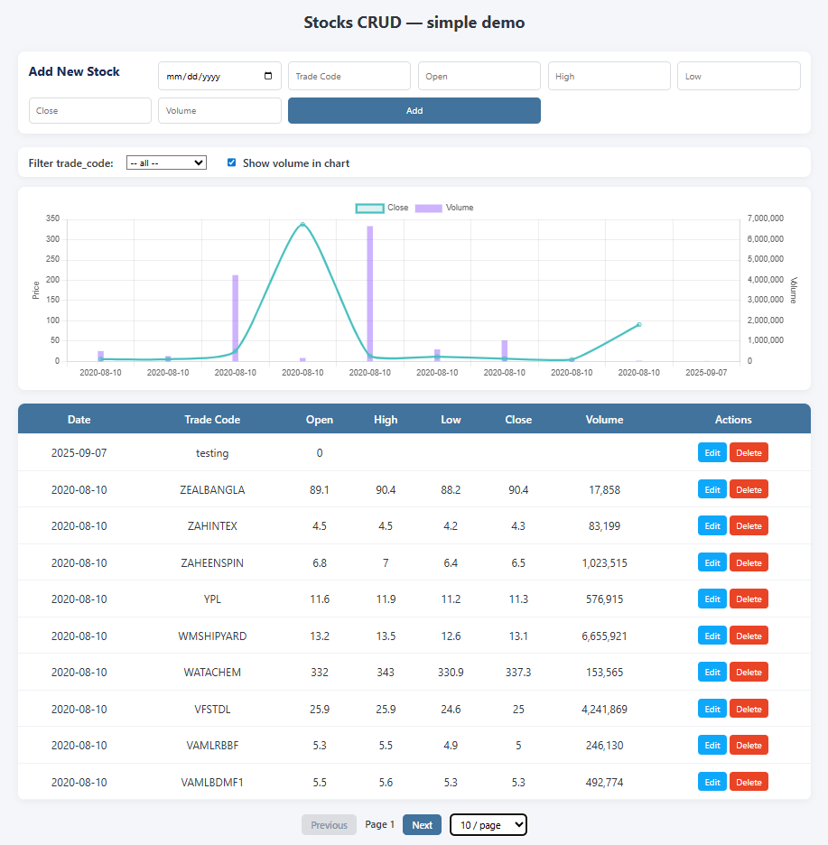

# 📈 Stocks CRUD Application

A full-stack CRUD application to manage stock data. Built with **FastAPI** + **SQLAlchemy** for the backend and **ReactJS** for the frontend.  

This project allows you to load stock data, view it in a table, visualize it in charts, and perform CRUD operations.

---

## 🚀 Features

- **Backend (FastAPI + SQLAlchemy):**
  - REST API for stock CRUD operations
  - PostgreSQL/SQLite database support
  - Pandas integration for bulk data load
  - Alembic migrations (optional)

- **Frontend (ReactJS):**
  - Responsive UI with stock table
  - Line chart for stock prices
  - CRUD operations with API integration

---

## 📂 Project Structure

```
stocks-crud/
├─ backend/
│  ├─ app/
│  │  ├─ __init__.py
│  │  ├─ main.py
│  │  ├─ models.py
│  │  ├─ schemas.py
│  │  ├─ database.py
│  │  ├─ crud.py
│  │  └─ load_data.py
│  ├─ requirements.txt
│  ├─ .env
│  └─ .gitignore
├─ frontend/
│  ├─ package.json
│  ├─ .env
│  ├─ .gitignore
│  └─ src/
│     ├─ index.js
│     ├─ App.js
│     ├─ api.js
│     ├─ components/
│        ├─ StockTable.js
│        └─ StockChart.js
└─ README.md
```

---

## ⚙️ Backend Setup (FastAPI)

1. **Navigate to backend folder**
   ```bash
   cd backend
   ```

2. **Create virtual environment**
   ```bash
   python -m venv .venv
   source .venv/bin/activate   # On Mac/Linux
   .venv\Scripts\activate      # On Windows
   ```

3. **Install dependencies**
   ```bash
   pip install -r requirements.txt
   ```

4. **Setup environment variables (`.env` file)**
   ```
   DATABASE_URL=sqlite:///./stocks.db
   ```

5. **Run FastAPI server**
   ```bash
   uvicorn app.main:app --reload
   ```

Backend will run at 👉 `http://127.0.0.1:8000`  
API docs available at 👉 `http://127.0.0.1:8000/docs`

---

## 💻 Frontend Setup (ReactJS)

1. **Navigate to frontend folder**
   ```bash
   cd frontend
   ```

2. **Install dependencies**
   ```bash
   npm install
   ```

3. **Setup environment variables (`.env` file)**
   ```
   REACT_APP_API_URL=http://127.0.0.1:8000
   ```

4. **Run React development server**
   ```bash
   npm start
   ```

Frontend will run at 👉 `http://localhost:3000`

---

## 🛠️ Common Commands

### Backend

* Run server:
  ```bash
  uvicorn app.main:app --reload
  ```

* Run data loader:
  ```bash
  python -m app.load_data
  ```

### Frontend

* Start app:
  ```bash
  npm start
  ```

* Build for production:
  ```bash
  npm run build
  ```

---

## 📝 API Endpoints

* `GET /stocks/` → List all stocks  
* `POST /stocks/` → Create a stock  
* `GET /stocks/{id}` → Get stock by ID  
* `PUT /stocks/{id}` → Update stock  
* `DELETE /stocks/{id}` → Delete stock  

---

## 📸 Screenshots

### Stock Table


### Stock Chart


### Full Page


---

## 🔒 .gitignore Setup

### Backend (`backend/.gitignore`)
```
__pycache__/
*.py[cod]
*$py.class
.env
.venv/
venv/
env/
*.db
*.sqlite3
*.sqlite
.vscode/
.idea/
.DS_Store
*.log
```

### Frontend (`frontend/.gitignore`)
```
node_modules/
build/
dist/
.env
npm-debug.log*
yarn-debug.log*
yarn-error.log*
.vscode/
.idea/
.DS_Store
```

---

## 👨‍💻 Author

**Fuad Khan** – Software Engineering Student
